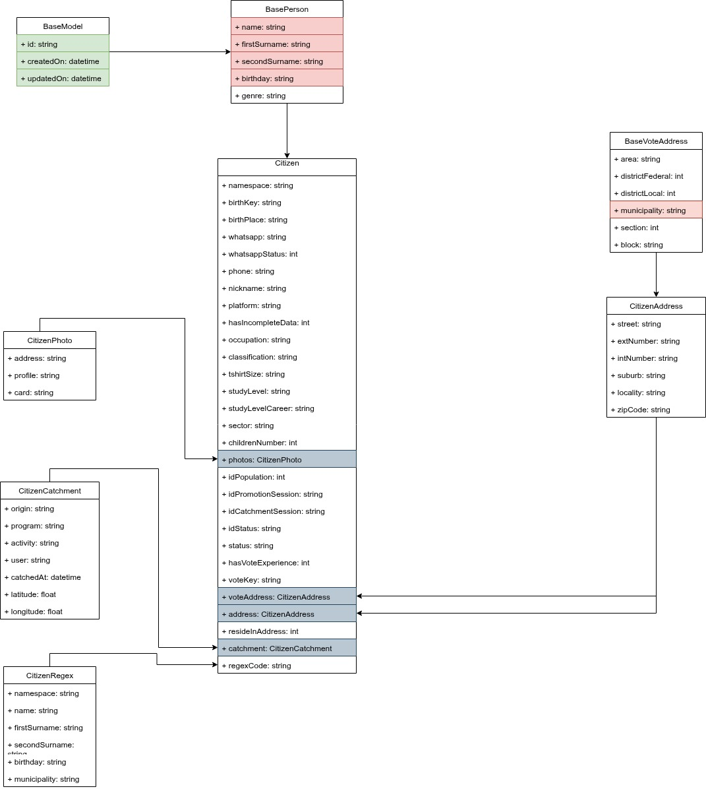

# Captación de Ciudadanos


Endpoint: `api/citizens`

## Descripción

El proceso de captación ciudadanos es el resultado de la captura y guardado de datos mediante la AppWeb o la AppAvanza. Este proceso inicia mediante un acercamiento iniciar por parte de un brigadista o asistencia (registro) de un ciudadano a algún programa o actividad.

### Requisitos obligatorios
Los datos básicos para realizar un proceso de captación son los siguientes:
- **Nombre(s)** (name)
- **Primer Apellido** (firstSurname)
- **Segundo Apellido** (secondSurname)
- **Fecha de Nacimiento** (bithday)
- Dirección (address)
  - **Municipio** (municipality)
  - Sección Electoral (section)
- Captación (catchment)
  - Origen (origin)
  - Actividad (activity)

De la lista previa, cinco datos en negrita permiten formar una clave única e interna que permite la contención de registros duplicados, lo que permite tener un catálogo de Ciudadanos lo más exento de duplicidades.

## Estructura de request/response

```
{
  id: "string"
  createdOn: "date",
  updatedOn: "date",
  name: "string",
  firstSurname: "string",
  secondSurname: "string",
  genre: MASCULINO,
  birthday: "string",
  birthKey: "string",
  birthPlace: "string",
  whatsapp: "string",
  whatsappStatus": "number",
  phone: "number",
  address: {
    area: "string"
    districtFederal: "number",
    districtLocal: "number",
    municipality: "string",
    section: "number",
    block: "string",
    street: "string",
    extNumber: "string",
    intNumber: "string",
    locality: "string",
    suburb: "string",
    zipCode: "string",
    sector: "string"
  },
  nickname: "string",
  platform: "string",
  hasIncompleteData: "number",
  ocupation: "string",
  classification: "string",
  tshirtSize: "string",
  studyLevel: "string",
  studyLevelCareer: "string",
  sector: "string",
  childrenNumber: "number",
  photos: {
    address": "string",
    profile": "string",
    card: "string"
  }
  idCatchmentSession: "string",
  idPopulation: "number",
  idPromotionSession: "string",
  idStatus: "number",
  hasVoteExperience: "number",
  voteKey: "string",
  voteAddress: {
    area: "string"
    districtFederal: "number",
    districtLocal: "number",
    municipality: "string",
    section: "number",
    block: "string",
    street: "string",
    extNumber: "string",
    intNumber: "string",
    locality: "string",
    suburb: "string",
    zipCode: "string",
    sector: "string"
  },
  resideInAddress: "number",
  catchment: {
    catchedAt: "date",
    origin: "string",
    program: "string",
    activity: "string",
    user: "string",
    latitude: "number",
    longitude: "number",
  },
  regexCode: "string"  
}
```

## Modelo



# DEVELOPMENT ESTIMATES

## Entregable:
### Backend tiempo (3 días)
  - Endpoints
    - **CREATE**
    - **UPDATE**
    - **DELETE**
    - **SINGLE**
    - **LIST**
    - Implícito
      - **Seguridad**
      - **Validaciones**

### Frontend (5 días)
  - Componente de Catálogo
    - Estructura archivos .ts
  - Servicio de consulta al API
  - Validaciones en formulario
  - Datos de otros catálogos necesarios para ingresar el nuevo registro
    - Datos ingresados
  - Precondiciones
    - Catálogo de datos geopolíticos (Proporcionar documentación)
    - Catálogo de usuario (Proporcionat estatus)

## Prerequisitos antes de iniciar la asignación (2 días)
- Definir modelado de datos de la entidad Ciudadano (Citizen); indicar si se reutilizará el modelado realizado en Campeche. 3 Hrs
- Aprobación del modelado. Máximo 24hrs tras notificación