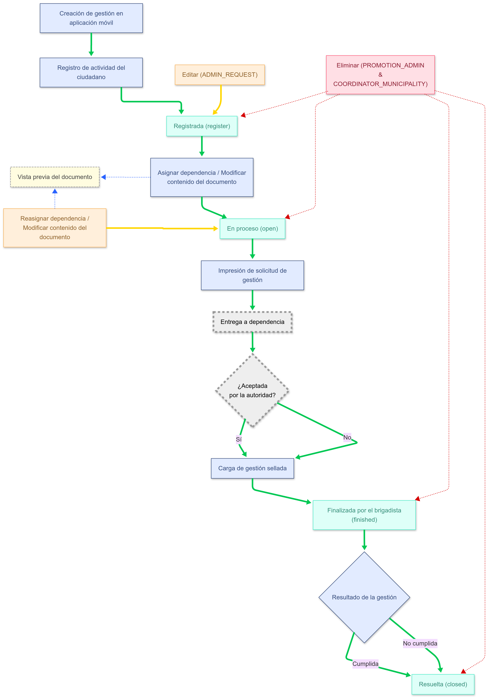

# Proceso de gestión
En este apartado se describe cada una de las fases del proceso de promoción, los estatus que puede tomar y las acciones que se pueden realizar dependiendo de cada estatus.
## Diagrama de proceso
  

---

## Leyenda de flechas (flujos del proceso)

 **Flechas verdes** indican el **flujo correcto (happy path)** del proceso.  
 **Flechas rojas** indican el **flujo de eliminación** dentro del proceso.  
 **Flechas amarillas** indican el **flujo de procesos secundarios**.  
 **Flechas azules** indican el **flujo de subprocesos** dentro de los procesos secundarios (amarillos).  

---

## Leyenda de operaciones y etapas

| Elemento | Significado |
|---------|-------------|
| Cuadros y rombos azules | Representan operaciones realizadas en la plataforma (móvil o web). |
| Cuadros verdes | Representan los **estatus** o **etapas** de la gestión. |
| Cuadros rojos | Representan operaciones de **eliminación**, ejecutadas por usuarios con permisos (`PROMOTION_ADMIN`, `COORDINATOR_MUNICIPALITY`). Estas pueden ocurrir en cualquier etapa. |
| Cuadros y rombos grises | Representan pasos que se realizan de manera **presencial**, fuera del sistema (ej. entrega física a la dependencia). |
| Cuadros amarillos | Operaciones que **permiten modificar** la gestión, como editar o reasignar dependencia. |
| Cuadro amarillo claro | Operación de **visualización**, como vista previa del documento. |


## Descripción  
1. El proceso inicia con el **registro de la gestión en la aplicación móvil**.
2. Al guardarse, se **registra como actividad vinculada al historial del ciudadano**.
3. El estatus inicial de la gestión es **Registrada (register)**. En este punto:
   - Un usuario con perfil `ADMIN_REQUEST` puede **editar** la gestión.
   - Usuarios con perfil `PROMOTION_ADMIN` o `COORDINATOR_MUNICIPALITY` pueden **eliminar** la gestión.
4. El siguiente paso es **asignar la dependencia responsable** y **modificar el contenido del documento**, lo que cambia el estatus a **Abierta (open)**.
   - Es posible visualizar una **vista previa del documento**.

5. En el estatus "open":
   - Se puede **reasignar la dependencia** y **modificar nuevamente el documento**.
   - Es posible visualizar una **vista previa del documento**.
   - Usuarios con perfil `PROMOTION_ADMIN` o `COORDINATOR_MUNICIPALITY` pueden **eliminar** la gestión.
6. Posteriormente:
   - Se realiza la **impresión de la solicitud**.
   - Se lleva a cabo la **entrega física del documento a la dependencia**.
7. La autoridad puede **aceptar o rechazar** la solicitud. Sin importar la respuesta:
   - Se realiza la **carga de la gestión sellada** al sistema.
8. Luego, la gestión es marcada como **Finalizada por el brigadista (finished)**.
   - Usuarios con perfil `PROMOTION_ADMIN` o `COORDINATOR_MUNICIPALITY` pueden **eliminar** la gestión.
9. En esta etapa, se **asigna el resultado** de la gestión: **Cumplida** o **No cumplida**.
10. Finalmente, la gestión pasa al estatus **Resuelta (closed)**.  
   - Usuarios con perfil `PROMOTION_ADMIN` o `COORDINATOR_MUNICIPALITY` pueden **eliminar** la gestión

---

   ## Perfiles involucrados

- `PROMOTION_ADMIN`
- `COORDINATOR_MUNICIPALITY`
- `ADMIN_REQUEST`

---   

# Entregable: Módulo de Gestión  
---

## Backend

### Endpoints requeridos:
- `CREATE` – Crear nueva gestión
- `CUSTOM UPDATE` – Actualización personalizada de una gestión
- `DELETE (LÓGICA)` – Eliminación lógica de la gestión
- `SINGLE` – Consulta individual de una gestión
- `LIST` – Listado general de gestiones
- `MAKE PDF` – Generación de PDF
- `MAKE PREVIEW PDF` – Vista previa del documento en PDF

## Frontend

### Desarrollo del componente del módulo de gestión:
- Estructura de la **interfaz**
- Lógica en **TypeScript**
- Diseño en **HTML**
- Validaciones en el formulario
- Servicio de consulta al API

---

## Precondiciones
- Catálogo de **dependencias**
- Catálogo de **funcionarios**
- Catálogo de **tipos de trámites**
- Catálogo de **plantillas**


---
# Estructura de Solicitud (App Avanza)

```json
{
  "address": {
    "federalDistrict": number,
    "localDistrict": number,
    "section": number,
    "block": number,
    "promotionBlock": number,
    "street": string,
    "extNumber": string,
    "intNumber": string,
    "suburb": string,
    "municipality": string,
    "locality": string,
    "zipCode": string
  },
  "voteAddress": {
    "federalDistrict": number,
    "localDistrict": number,
    "section": number,
    "block": number,
    "promotionBlock": number,
    "street": string,
    "extNumber": string,
    "intNumber": string,
    "suburb": string,
    "municipality": string,
    "locality": string,
    "zipCode": string
  },
  "attachments": array, //[string]
  "description": string,
  "idStatus": number,   //Siempre 1
  "phase": number,      //Siempre 1
  "ref": string,
  "sector": string,
  "status": string,     //Siempre "register"
  "typeRequest": string,
  "username": string,
  "resideInAddress": number,
  "latitude": number,
  "longitude": number,
  "block": number,
  "formality": string,
  "municipality": string,
  "districtFederal": number,
  "districtLocal": number,
  "section": number,
  "citizenId": string,
  "names": string,
  "secondSurname": string,
  "firstSurname": string,
  "whatsapp": string,
  "phone": string,
  "whatsappStatus": number,
  "birthday": string,
  "genre": string,
  "zRequestedAt": Date   // Ejemplo: 2025-08-11T11:35:34.000+00:00
}
---

