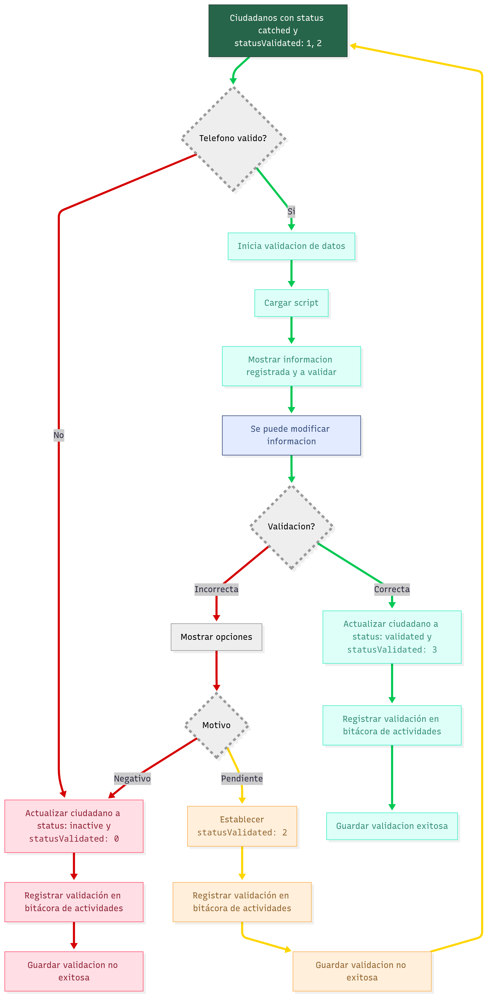

# Proceso de validación de ciudadanos
Endpoint: `api/data-validations`

En este apartado se describe el proceso de validación de datos de los ciudadanos, incluyendo las distintas rutas que puede seguir y cómo se gestiona al ciudadano durante esta validación. El objetivo principal es que el ciudadano alcance el status 2 (validated), asegurando que su información y datos de contacto sean correctos, con el fin de prevenir inconsistencias o errores en futuras actividades.

## Diagrama de proceso
  

---

## Leyenda de flechas (flujos del proceso)

**Flechas verdes** indican el **flujo correcto (happy path)** del proceso.  
**Flechas rojas** indican el **flujo negativo** dentro del proceso.  
**Flechas amarillas** indican el **flujo pendiente dentro del proceso**.  

---

## Leyenda de operaciones y etapas

| Elemento | Significado |
|---------|-------------|
| Cuadros verdes | Representan los **momentos** del proceso de validación. |
| Cuadros y rombos grises | Representan **procesos de validación** y **puntos de decisión** dentro del proceso. |
| Cuadros azules | Representan **operaciones opcionales** dentro del proceso |
| Cuadros rojos | Representan operaciones de **negativas o no exitosas** dentro del proceso |
| Cuadros amarillos | Representan **procesos pendientes** que requieren seguimiento posterior. |
| Cuadros verde claro | Representan **operaciones exitosas** de actualización y registro. |

---

   ## Valores de statusValidated

- `0: Imposible validar`
- `1: Por validar`
- `2: Llamar más tarde `
- `3: Validado `


---

## Descripción
1. El proceso inicia con **ciudadanos con status catched y statusValidated: 1, 2**.
2. Se realiza la **validación del teléfono**:
   - **Sí es válido**: Continúa al siguiente paso del proceso.
   - **No es válido**: Se dirige al flujo de inactivación del ciudadano.
3. Se **inicia la validación de datos** del ciudadano.
4. Se procede a **cargar el script** necesario para la validación.
5. Se **muestra la información registrada y a validar** al usuario de callcenter.
6. El sistema permite **modificar la información** si es necesario.
7. Se ejecuta el proceso de **validación** final:
   - **Validación correcta**: Se continúa con el flujo exitoso.
   - **Validación incorrecta**: Se muestran opciones adicionales.

### Flujo exitoso (validación correcta):
8. Se **actualiza el ciudadano a status: validado y statusValidated: 3**.
9. Se **registra la validación en la bitácora de actividades**.
10. Se **guarda la validación exitosa** en el sistema.

### Flujo de validación incorrecta:
8. Se **muestran opciones** al usuario para proceder.
9. Se evalúa el **motivo** de la validación incorrecta:
   - **Motivo negativo**: Se actualiza el ciudadano a status: inactivo y statusValidated: 0, se registra en bitácora y se guarda como validación no exitosa.
   - **Motivo pendiente**: Se establece statusValidated: 2, se registra en bitácora de actividades y se guarda como validación no exitosa.


---

# Entregable: Módulo de validación de datos

## Backend
### Endpoints requeridos:
- `CREATE` – Crear nuevo registro de validación.
- `LIST` – Listado general de validaciones.
- `GET SCRIPT` – Generación de script con datos del ciudano a validar.

## Frontend

### Desarrollo del componente del módulo de validación
- Estructura de la **interfaz**
- Lógica en **TypeScript**
- Diseño en **HTML**
- Validaciones en el formulario
- Servicio de consulta al API

---

## Precondiciones
- Catálogo de **scripts**
- **Segmentado** de ciudadanos a validar por usuarios


## Estructura de creación de validación
```json
{
  "code": "number",
  "citizenId": "string",
  "firstSurname": "string",
  "secondSurname": "string",
  "phone": "string",
  "validatedBy": "string",
  "motiv?": "string",
  "observations": "string",
  "data?": "ValidationData"
}
```
## ValidationData
```json
 {
  "names": "string",
  "firstSurname": "string",
  "secondSurname": "string",
  "genre": "string",
  "whatsapp": "string",
  "phone": "number",
  "zipCode": "number",
  "municipality": "string",
  "locality": "string",
  "suburb": "string",
  "street": "string",
  "numExt": "string",
  "numInt": "string",
  "birthday": "string",
  "origin": "string",
  "program": "string",
  "activity": "string",
}
```
## getScript
```json
{
  "user": "string",
  "names": "string",
  "catchmentUser": "string",
  "formality": "string",
  "firstSurname": "string", 
  "secondSurname": "string",
  "address": {
    "street": "string",
    "extNumber": "string",
    "suburb": "string",
    "zipCode": "string"
  },
  "birthday": "string"
}
```